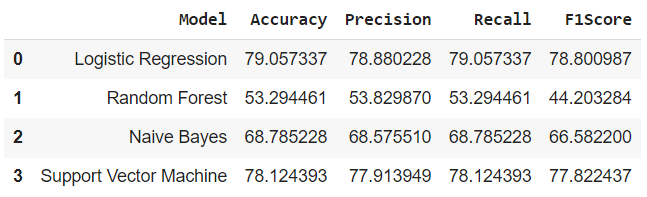

 
  

In this project, I have attempted to analyze the Covid-19 related tweets dataset and build a machine learning model to classify a tweet as positive, negative or neutral.

## :floppy_disk: Project Files Description</h2>

This project contains an executable iPython Notebook, a presentation and source as follows:

<h4>Executable Files:</h4>
<ul>
  <li><b>Sentiment_Analysis_of_Covid_19_related_Tweets.ipynb</b> - Google Colab notebook containing data summary, exploration, visualisations, text processing, modelling and performance evaluation.</li>
</ul>

<h4>Source Directory:</h4>
<ul>
  <li><b>Coronavirus Tweets.csv</b> - Includes Covid-19 related tweets data.</li>
</ul>

## :book: Problem Statement

Since the outbreak of coronavirus, it has affected more than 180 countries where massive losses in the economy and jobs globally and confining about 58% of the global population are caused. The research on people’s feelings is essential for keeping mental health and informed about Covid-19.
The given challenge is to build a classification model to predict the sentiment of Covid-19 tweets.

## :book: Approach

1.	Understanding the business task.
2.	Reading data from files given.
3.	Data pre-processing.
4.	Data visualization.
5.	Text processing.
6.	Modelling data.
7.	Conclusion.

## :book: Text Processing

<li>Stemming is used for text normalization since getting base words is more crucial than the meaning of words to determine whether the message is positive or not.</li> 
<li>TF-IDF was used for feature extraction from text since just the importance of words also needs to be considered.</li> 

## :book: Modelling

Four different algorithms were tried out to find out which one performs the best.
1. Logistic Regression
2. Random Forest
3. Naive Bayes
4. Support Vector Machine

## 📘: Conclusion

The model built using logistic regression algorithm has the highest accuracy, followed by the one using SVM.
Therefore logistic regression model can be used for sentiment analysis.

## :scroll: Credits

Midhun R | Avid Learner | Data Analyst | Data Scientist | Machine Learning Enthusiast

 <i> Contact me for Data Science Project Collaborations</i>

## :books: References
<ul>
  <li>
DataRobot, 'Using Machine Learning for Sentiment Analysis: a Deep Dive'. [Online].

      
Available: https://www.datarobot.com/blog/using-machine-learning-for-sentiment-analysis-a-deep-dive/

  </li>
  <li>
Analytics Vidhya, 'Quick Introduction to Bag-of-Words (BoW) and TF-IDF for Creating Features from Text'. [Online].

      
Available: https://www.analyticsvidhya.com/blog/2020/02/quick-introduction-bag-of-words-bow-tf-idf/

  </li>
  <li>
Scikit-learn, 'A tutorial on statistical-learning for scientific data processing'. [Online].

      
Available: https://scikit-learn.org/stable/tutorial/statistical_inference/

  </li>
</ul>
